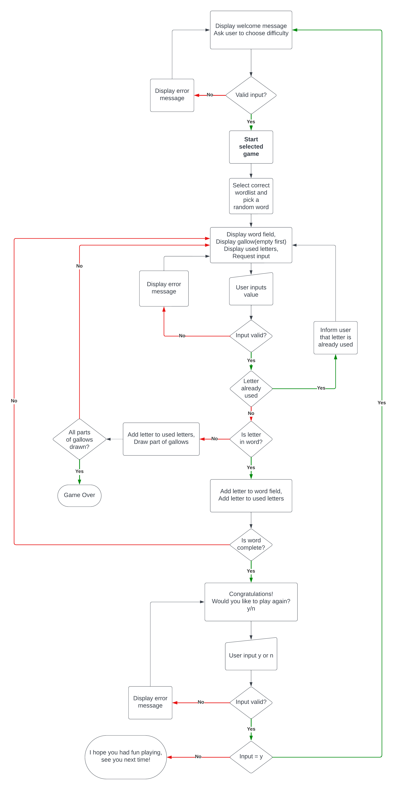
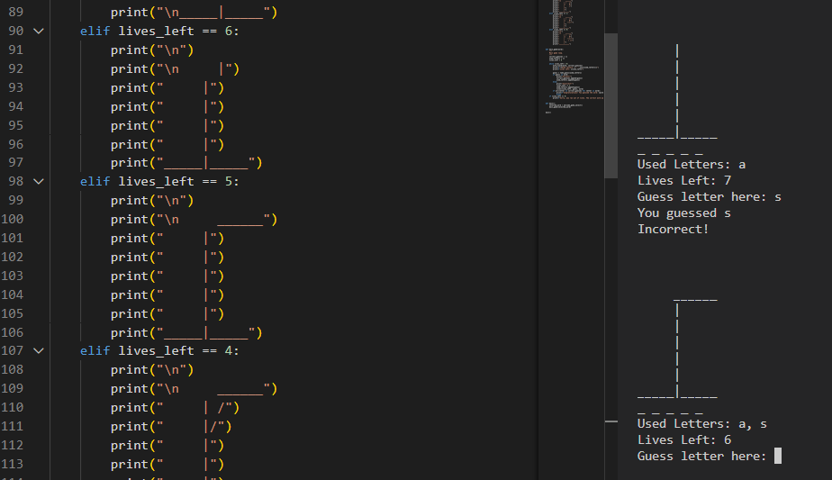

# Hangman

## Introduction

## Table of contents

- [Hangman](#hangman)
  - [Introduction](#introduction)
  - [Table of contents](#table-of-contents)
  - [User goals](#user-goals)
    - [Goals of the website](#goals-of-the-website)
    - [Goals of the user](#goals-of-the-user)
  - [User stories](#user-stories)
      - [Website owner](#website-owner)
      - [General user](#general-user)
      - [New user](#new-user)
  - [Design](#design)
  - [Bugs](#bugs)
    - [Bug 1](#bug-1)

## User goals

### Goals of the website

- The goal of the website is to provide a command-line based game for entertainment.

- The instructions are easy to understand.

- The program handles user error.

- The program has no internal errors.

- The game can be played multiple times due to a large amount of words supplied,
  
  and different difficulty settings.

### Goals of the user

- The user wants to play a word-based game with a large variety of words.

- They want to be able to choose difficulty.

- The game should be easy to understand.

## User stories

### Website owner

- As the owner of the website, I want to create a user-friendly game that is accessible
  
  to as many people as possible through sipmple user interface.

- I want to tailor the game to people of different skill levels, so having difficulty
  
  settings will allow players to choose the setting they prefer.

- The library of words must be large to help prevent repetition.

### General user

As a user I expect the game to run without errors.

The game shows me progress, what letters I have used, and what letters I guessed correcly.

If I make an input that is not valid, the game should tell me what went wrong and what

was expected, without crashing.

As I grow increasingly better at the game, I want to be able to pick between difficulty

settings, that will provide longer or shorter words.

### New user

As a new user of the website, I expect to quickly understand how to play the game.

My inputs, if I get something wrong, will not break the game, but instead tell me what

went wrong and what was expected.

## Design

As part of the design process I layed out a flowshart for my codes logic,

and you can se it here: 

## Bugs

### Bug 1

When the game is played, the hangman diplays the wrong drawing.

For example, when lives left are 6, the hangman for 5 lives is displayed.

