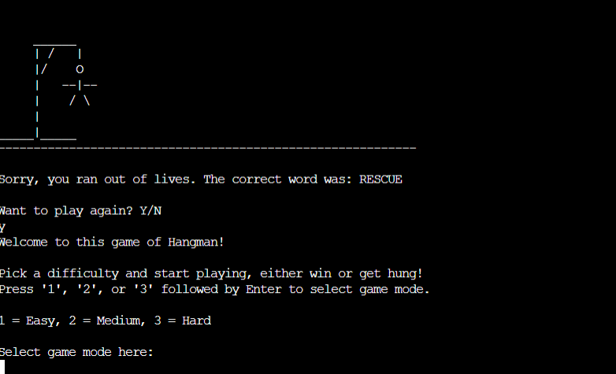

# Hangman

## Introduction

[Pythonic Hangman](https://pythonic-hangman-0358ff7c5393.herokuapp.com/) is a fun text-based
game of Hangman, that runs in a mock terminal on Heroku.

You are able to choose from three difficulty levels, and depending on your choice,

the length of the words to guess will be different.

Have a go, see if you can guess the word, or if you get hung!

## Table of contents

- [Hangman](#hangman)
  - [Introduction](#introduction)
  - [Table of contents](#table-of-contents)
  - [User goals](#user-goals)
    - [Goals of the website](#goals-of-the-website)
    - [Goals of the user](#goals-of-the-user)
  - [User stories](#user-stories)
      - [Website owner](#website-owner)
      - [General user](#general-user)
      - [New user](#new-user)
  - [Design](#design)
  - [Features](#features)
    - [Welcome screen and game select](#welcome-screen-and-game-select)
    - [User input guess](#user-input-guess)
    - [End of game](#end-of-game)
  - [Features to add](#features-to-add)
  - [Data model](#data-model)
  - [Testing](#testing)
    - [Validation](#validation)
    - [Manual testing](#manual-testing)
      - [Welcome and game select](#welcome-and-game-select)
      - [Word selection](#word-selection)
      - [Input validation](#input-validation)
  - [Bugs](#bugs)
    - [Bug 1](#bug-1)
  - [Fixed bugs](#fixed-bugs)
    - [Bug 1](#bug-1)
  - [Remaining bugs](#remaining-bugs)

## User goals

### Goals of the website

- The goal of the website is to provide a command-line based game for entertainment.

- The instructions are easy to understand.

- The program handles user error.

- The program has no internal errors.

- The game can be played multiple times due to a large amount of words supplied,
  
  and different difficulty settings.

### Goals of the user

- The user wants to play a word-based game with a large variety of words.

- They want to be able to choose difficulty.

- The game should be easy to understand.

## User stories

### Website owner

- As the owner of the website, I want to create a user-friendly game that is accessible
  
  to as many people as possible through sipmple user interface.

- I want to tailor the game to people of different skill levels, so having difficulty
  
  settings will allow players to choose the setting they prefer.

- The library of words must be large to help prevent repetition.

### General user

As a user I expect the game to run without errors.

The game shows me progress, what letters I have used, and what letters I guessed correcly.

If I make an input that is not valid, the game should tell me what went wrong and what

was expected, without crashing.

As I grow increasingly better at the game, I want to be able to pick between difficulty

settings, that will provide longer or shorter words.

### New user

As a new user of the website, I expect to quickly understand how to play the game.

My inputs, if I get something wrong, will not break the game, but instead tell me what

went wrong and what was expected.

## Design

As part of the design process I layed out a flowshart for my codes logic,

and you can se it here: 

## Features

### Welcome screen and game select

- When you first open the game, a welcome message will greet you.

- The game will then ask you to choose a difficulty level.

- If you do not enter a valid choice, the game will tell you, and then tell you what is expected.

### User input guess

- The game checks that user input is valid, and if it is not, it tells the user what went wrong
  
  and what was expected. Then prompts the user to guess again.

- Before the game checks if the letter is in the current game word,
  
  it checks to see if the letter has already been used.

- If the user guesses a letter that is not in the word, the game tells them they guessed incorrectly.
  
  The next stage of the hangman is drawn, they lose a life, and letter gets added to used letters.

- If the user guesses a letter that is in the word, the game tells them they were correct.
  
  No new hangman is drawn, they keep all their lives, letter gets added to used letters.

### End of game

- When the user win or lose the game, they will be asked if they want to play again.
  
  If they choose Y, the game will restart from the beginning.

  If they choose N, a goodbye message is printed and the game will stop running.

- Here a new game was chosen to be played.

- Here the user chose to not play another game.

- Input has to be valid, or the game will tell you what was expected, and what you entered.

## Features to add

- Players could be able to choose how many lives they want to have.

- Additional game modes could be added, for extra simple or difficult words.

## Data model

The data model for this hangman game mainly uses strings and lists.

- Depending on game mode chosen, the program will generate a list with words of a specific length,
  
  and then chose a random one from that list, to present for the user to guess.

- The other lists keep track of player progress and are used to provide feedback.

Other logic have also been implemented with validation for when the user tries to guess a letter,

using a try/except statement.

At the end of the game an option is presented to play again, and if no is chosen, the game will terminate.

## Testing

### Validation

The code was run through [PEP8 Python Linter](https://pep8ci.herokuapp.com/)
with no errors to show.

### Manual testing

Each Title under "Works" has been tested, and marked with an X for yes or no.

Everything was tested continously throughout development, and all tests were

run agian after deployment to Heroku.

#### Welcome and game select

|Works           |YES |NO |
|---------------|:---:|---|
|Welcome screen  |X  |   |
|Game mode Easy  |X  |   |
|Game mode Medium|X  |   |
|Game mode Hard  |X  |   |
|Input Validation|X  |   |

#### Word selection

|Works                 |YES |NO |
|---------------------|:---:|---|
|Word selection Easy   |X   |   |
|Word selection Medium |X   |   |
|Word selection Hard   |X   |   |

#### Input validation

|Works                   |YES |NO |
|------------------------|:---:|---|
|Validate game select    |X   |   |
|Validate guess letter   |X   |   |
|Validate play again     |X   |   |

## Bugs

### Bug 1

When the game is played, the hangman diplays the wrong drawing.

For example, when lives left are 6, the hangman for 5 lives is displayed.

## Fixed bugs

### Bug 1

I found an issue in the main game loop that caused this bug.

I was calling the lives function, on line 176, that decrements lives_left,

after I had already decremented the lives_left variable on line 174.

This was fixed by calling the lives function before I decrement the lives_left variable in the else statement.

## Remaining bugs

- I have not found any bugs that remains unfixed.
